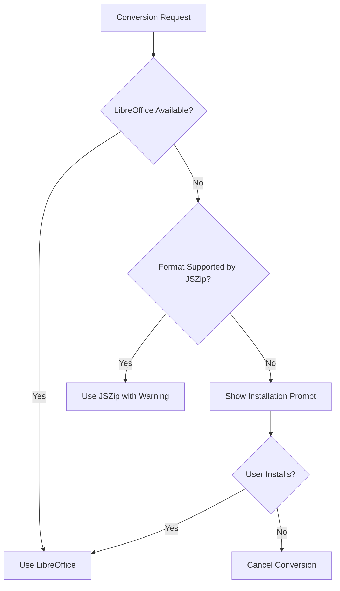

# ADR-003: Integrate LibreOffice for Complex Format Conversions

## Status
**Accepted** - 2025-11-04

## Context
While JSZip handles DOCX/XLSX formats well, some conversion scenarios require more sophisticated processing:
- PDF to DOCX conversion
- Legacy formats (DOC, XLS, PPT)
- Complex formatting preservation
- Image and table handling
- Non-Office formats (ODT, ODS, etc.)

### Considered Alternatives

1. **LibreOffice (Headless Mode)**
   - Pros: Comprehensive format support, excellent quality, free/open-source
   - Cons: External dependency, large installation size, slower than libraries

2. **Apache POI (Java)**
   - Pros: Pure Java, good Office format support
   - Cons: Requires Java runtime, Node.js integration complexity

3. **Python + unoconv**
   - Pros: Good LibreOffice wrapper, scriptable
   - Cons: Python dependency, additional runtime overhead

4. **Commercial APIs (CloudConvert, etc.)**
   - Pros: High quality, no local dependencies
   - Cons: Internet required, ongoing costs, privacy concerns

5. **Pure JavaScript Libraries**
   - Pros: No external dependencies
   - Cons: Limited format support, quality issues with complex documents

## Decision
We chose **LibreOffice (headless)** as an **optional** external tool for the following reasons:

### Technical Factors
- **Comprehensive Support**: Handles virtually all document formats
- **High Quality**: Excellent conversion accuracy and formatting preservation
- **Headless Mode**: Can run without GUI (--headless --convert-to)
- **CLI Interface**: Easy to invoke from Node.js
- **Well-Maintained**: Active development, regular updates

### Business Factors
- **Free and Open-Source**: No licensing costs
- **Offline Operation**: Aligns with application's offline-first design
- **Industry Standard**: Widely used and trusted
- **Optional Dependency**: App works without it (graceful degradation)

## Consequences

### Positive
- ✅ Supports 100+ file formats
- ✅ Excellent conversion quality
- ✅ Preserves complex formatting (tables, images, styles)
- ✅ No cost or licensing issues
- ✅ Can run offline
- ✅ Actively maintained with security updates
- ✅ Fallback to JSZip if not installed

### Negative
- ❌ External dependency (user must install separately)
- ❌ Large installation size (~600MB)
- ❌ Slower than pure JavaScript solutions
- ❌ Process spawn overhead
- ❌ Platform-specific paths and behaviors
- ❌ Potential version compatibility issues

### Mitigations
- **Optional Installation**: App detects presence, offers fallback
- **Clear Documentation**: Installation instructions for users
- **Path Detection**: Auto-detect LibreOffice installation
- **Timeout Handling**: Prevent hung processes
- **Error Messages**: Guide users to install LibreOffice if needed

## Implementation

### LibreOffice Detection
```javascript
const { spawn } = require('child_process');
const fs = require('fs').promises;
const path = require('path');

class LibreOfficeIntegration {
  constructor() {
    this.libreOfficePath = null;
    this.isAvailable = false;
  }

  async detect() {
    const possiblePaths = [
      '/Applications/LibreOffice.app/Contents/MacOS/soffice',
      '/usr/bin/soffice',
      '/usr/local/bin/soffice',
    ];

    for (const testPath of possiblePaths) {
      try {
        await fs.access(testPath, fs.constants.X_OK);
        this.libreOfficePath = testPath;
        this.isAvailable = true;
        return true;
      } catch (error) {
        continue;
      }
    }

    return false;
  }

  async convert(inputPath, outputFormat, options = {}) {
    if (!this.isAvailable) {
      throw new Error('LibreOffice not installed. Please install from https://www.libreoffice.org/');
    }

    const args = [
      '--headless',
      '--convert-to', outputFormat,
      '--outdir', options.outputDir || path.dirname(inputPath),
      inputPath
    ];

    return new Promise((resolve, reject) => {
      const process = spawn(this.libreOfficePath, args, {
        timeout: options.timeout || 60000 // 60 second timeout
      });

      let stdout = '';
      let stderr = '';

      process.stdout.on('data', (data) => {
        stdout += data.toString();
      });

      process.stderr.on('data', (data) => {
        stderr += data.toString();
      });

      process.on('close', (code) => {
        if (code === 0) {
          const outputFile = this.getOutputPath(inputPath, outputFormat, options.outputDir);
          resolve(outputFile);
        } else {
          reject(new Error(`LibreOffice conversion failed: ${stderr}`));
        }
      });

      process.on('error', (error) => {
        reject(new Error(`Failed to spawn LibreOffice: ${error.message}`));
      });
    });
  }

  getOutputPath(inputPath, outputFormat, outputDir) {
    const baseName = path.basename(inputPath, path.extname(inputPath));
    const dir = outputDir || path.dirname(inputPath);
    return path.join(dir, `${baseName}.${outputFormat}`);
  }
}

module.exports = new LibreOfficeIntegration();
```

### Conversion Strategy
```javascript
const jszip = require('./jszip-converter');
const libreoffice = require('./libreoffice-integration');

async function convertDocument(inputPath, outputFormat) {
  const inputFormat = path.extname(inputPath).slice(1).toLowerCase();

  // Strategy 1: Use JSZip for DOCX <-> DOCX conversions (fast)
  if (['docx', 'xlsx'].includes(inputFormat) && ['docx', 'xlsx'].includes(outputFormat)) {
    return await jszip.convert(inputPath, outputFormat);
  }

  // Strategy 2: Use LibreOffice if available (comprehensive)
  if (await libreoffice.detect()) {
    return await libreoffice.convert(inputPath, outputFormat);
  }

  // Strategy 3: Fallback to JSZip with warning (limited)
  if (['docx', 'xlsx'].includes(inputFormat)) {
    console.warn('LibreOffice not installed. Using basic conversion.');
    return await jszip.convert(inputPath, outputFormat);
  }

  throw new Error(
    `Cannot convert ${inputFormat} to ${outputFormat}. ` +
    `Please install LibreOffice for advanced conversions.`
  );
}
```

### User Experience

**When LibreOffice is NOT installed**:
```
┌────────────────────────────────────────────┐
│  ⚠️ Enhanced Conversion Not Available      │
├────────────────────────────────────────────┤
│  For best conversion quality and support   │
│  for more formats, please install:         │
│                                            │
│  LibreOffice (Free)                        │
│  → Download: libreoffice.org               │
│                                            │
│  [ Install Later ]  [ Download Now ]      │
└────────────────────────────────────────────┘
```

**When LibreOffice IS installed**:
```
✓ LibreOffice detected
  Advanced conversions enabled
```

## Supported Conversions

### With JSZip Only (Basic)
- DOCX ↔ DOCX (text extraction/creation)
- XLSX ↔ XLSX (data extraction/creation)

### With LibreOffice (Advanced)
- **To PDF**: DOCX, DOC, XLSX, XLS, PPTX, PPT, ODT, ODS, ODP, TXT, HTML
- **To DOCX**: PDF, DOC, ODT, RTF, TXT, HTML
- **To XLSX**: XLS, ODS, CSV
- **To HTML**: DOCX, DOC, XLSX, XLS, PDF
- **And 100+ more format combinations**

## Performance Comparison

| Operation | JSZip | LibreOffice |
|-----------|-------|-------------|
| DOCX text extraction | 50ms | 500ms |
| DOCX creation | 100ms | 800ms |
| PDF → DOCX | N/A | 2-5s |
| Formatting preservation | Basic | Excellent |
| Startup overhead | None | 200-500ms |

## Security Considerations

### Process Isolation
- Spawn LibreOffice with minimal privileges
- Use temporary directories for intermediate files
- Timeout long-running conversions (prevent DoS)
- Validate input files before passing to LibreOffice

### Path Security
```javascript
function sanitizeForLibreOffice(filePath) {
  // Prevent command injection via file paths
  const normalized = path.normalize(filePath);

  if (normalized.includes(';') || normalized.includes('&') ||
      normalized.includes('|') || normalized.includes('`')) {
    throw new Error('Invalid characters in file path');
  }

  return normalized;
}
```

## Installation Guide for Users

**macOS**:
```bash
# Option 1: Download from website
open https://www.libreoffice.org/download/download/

# Option 2: Homebrew
brew install --cask libreoffice
```

**Verification**:
```bash
/Applications/LibreOffice.app/Contents/MacOS/soffice --version
```

## Fallback Strategy



## References
- [LibreOffice Documentation](https://www.libreoffice.org/)
- [Headless LibreOffice](https://help.libreoffice.org/latest/en-US/text/shared/guide/start_parameters.html)
- [Supported Formats](https://wiki.documentfoundation.org/Feature_Comparison:_LibreOffice_-_Microsoft_Office)

## Related Decisions
- [ADR-001](./0001-electron-framework.md) - Electron framework
- [ADR-002](./0002-jszip-for-docx.md) - JSZip as primary handler

---
**Reviewed By**: Development Team
**Next Review**: When exploring alternative conversion engines or cloud services
