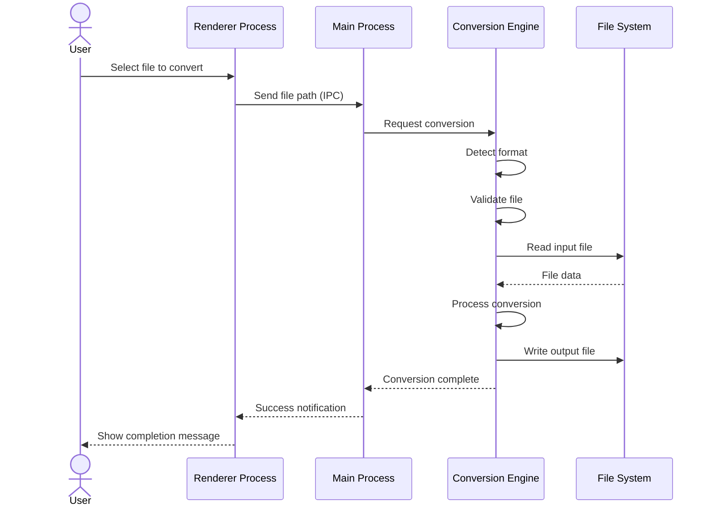
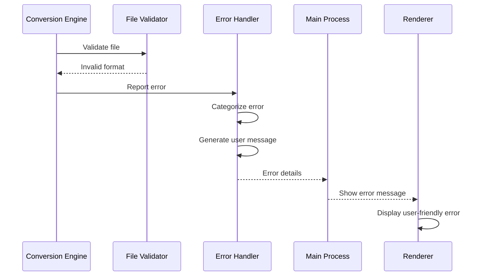

# Doc Converter - Architecture Documentation (ARC42)

## 1. Introduction and Goals

### 1.1 Requirements Overview

**Doc Converter** is a desktop application for macOS that enables users to convert documents between various formats.

**Key Requirements**:
- Convert between document formats (PDF, DOCX, XLSX, etc.)
- User-friendly drag-and-drop interface
- Fast and reliable conversion
- Offline operation (no cloud dependency)
- Support for batch conversion
- Preserve document formatting when possible

### 1.2 Quality Goals

| Priority | Quality Goal | Description |
|----------|-------------|-------------|
| 1 | **Usability** | Simple, intuitive interface requiring no technical knowledge |
| 2 | **Reliability** | Conversions must complete successfully with minimal errors |
| 3 | **Performance** | Fast conversion times, even for large documents |
| 4 | **Security** | Secure file handling with no data leakage |
| 5 | **Maintainability** | Clean, modular code architecture for easy updates |

### 1.3 Stakeholders

| Role | Expectations |
|------|-------------|
| **End Users** | Simple document conversion tool, reliable results |
| **Developers** | Maintainable codebase, clear architecture |
| **System Administrators** | Easy deployment, minimal system dependencies |

---

## 2. Architecture Constraints

### 2.1 Technical Constraints

| Constraint | Description |
|------------|-------------|
| **Platform** | macOS only (Electron framework) |
| **Technology** | Electron + Node.js + JavaScript |
| **Deployment** | Standalone .app bundle |
| **File System** | Local file access only |

### 2.2 Organizational Constraints

| Constraint | Description |
|------------|-------------|
| **Development** | Small team, rapid iteration |
| **Distribution** | Direct download (no app store initially) |
| **Support** | Community-driven |

### 2.3 Conventions

- **Code Style**: ESLint configuration for JavaScript
- **Architecture**: Electron multi-process model
- **Documentation**: Markdown format
- **Version Control**: Git with semantic versioning

---

## 3. System Scope and Context

### 3.1 Business Context

```
[User] → [Doc Converter] → [File System]
                          ↓
                   [LibreOffice (optional)]
```

**Actors**:
- **User**: Person converting documents
- **File System**: Source and destination for files
- **LibreOffice**: External conversion engine (optional)

### 3.2 Technical Context

**Technologies**:
- **Electron**: Cross-platform desktop framework
- **Node.js**: Server-side JavaScript runtime
- **JSZip**: ZIP archive manipulation for DOCX/XLSX
- **Chromium**: Rendering engine for UI

**Interfaces**:
- **File I/O**: Node.js fs module
- **IPC**: Electron inter-process communication
- **CLI**: Shell commands for LibreOffice

---

## 4. Solution Strategy

### 4.1 Technology Decisions

| Decision | Rationale |
|----------|-----------|
| **Electron** | Enables native desktop app with web technologies |
| **JSZip** | Pure JavaScript solution for DOCX/XLSX (ZIP-based formats) |
| **LibreOffice** | Powerful external converter for complex formats |
| **Multi-process** | Isolates UI from heavy conversion operations |

### 4.2 Top-Level Decomposition

The application follows Electron's multi-process architecture:

1. **Main Process**: Application lifecycle, file system access
2. **Renderer Process**: User interface
3. **Conversion Engine**: Document processing logic

### 4.3 Quality Goals Achievement

| Quality Goal | Strategy |
|--------------|----------|
| **Usability** | Drag-and-drop UI, minimal configuration |
| **Reliability** | Comprehensive error handling, file validation |
| **Performance** | Asynchronous processing, streaming for large files |
| **Security** | Sandboxed renderer, input validation, path sanitization |
| **Maintainability** | Modular components, clear separation of concerns |

---

## 5. Building Block View

### 5.1 Level 1: System Overview

```
┌─────────────────────────────────────┐
│      Doc Converter Application      │
├─────────────────────────────────────┤
│  • Main Process (Orchestration)     │
│  • Renderer Process (UI)            │
│  • Conversion Engine (Processing)   │
└─────────────────────────────────────┘
```

### 5.2 Level 2: Main Components

**Main Process**:
- Application Manager
- File System Handler
- IPC Coordinator
- External Tool Integrator

**Renderer Process**:
- UI Components
- File Selection
- Progress Display
- Settings Manager

**Conversion Engine**:
- Format Detector
- ZIP Handler (JSZip)
- PDF Converter
- DOCX Processor
- File Validator
- Error Handler

---

## 6. Runtime View

### 6.1 Typical Conversion Scenario



### 6.2 Error Handling Scenario



---

## 7. Deployment View

### 7.1 macOS Application Bundle

```
Doc Converter.app/
├── Contents/
│   ├── MacOS/
│   │   └── Doc Converter         # Executable
│   ├── Resources/
│   │   ├── app.asar              # Application code (packaged)
│   │   ├── app.asar.unpacked/    # Native modules
│   │   │   └── node_modules/
│   │   │       └── jszip/
│   │   └── icon.icns
│   ├── Frameworks/
│   │   └── Electron Framework.framework/
│   └── Info.plist
```

### 7.2 System Requirements

- **OS**: macOS 10.13 (High Sierra) or later
- **Memory**: 512 MB RAM minimum
- **Storage**: 200 MB for application
- **Optional**: LibreOffice for advanced conversions

---

## 8. Cross-Cutting Concepts

### 8.1 Security

**Principles**:
- Sandboxed renderer process (no direct file system access)
- Path sanitization to prevent directory traversal
- File type validation (whitelist approach)
- No external network requests
- Temporary files securely deleted

**Implementation**:
```javascript
// Path sanitization example
function sanitizePath(userPath) {
  const normalized = path.normalize(userPath);
  if (normalized.includes('..')) {
    throw new Error('Invalid path');
  }
  return normalized;
}
```

### 8.2 Error Handling

**Strategy**:
- Centralized error handler component
- User-friendly error messages
- Detailed logging for debugging
- Graceful degradation
- Recovery mechanisms

**Error Categories**:
1. File errors (not found, permission denied)
2. Format errors (unsupported, corrupted)
3. Conversion errors (processing failure)
4. System errors (out of memory, disk full)

### 8.3 Logging

**Levels**:
- **ERROR**: Conversion failures, exceptions
- **WARN**: Deprecated format usage, performance issues
- **INFO**: Conversion start/complete, format detection
- **DEBUG**: Detailed processing steps

**Storage**: Local log files in user's Application Support directory

---

## 9. Architecture Decisions

See [Architecture Decision Records](../adr/) for detailed decisions.

Key decisions:
- [ADR-001](../adr/0001-electron-framework.md): Use Electron framework
- [ADR-002](../adr/0002-jszip-for-docx.md): Use JSZip for DOCX processing
- [ADR-003](../adr/0003-libreoffice-integration.md): Integrate LibreOffice for complex conversions

---

## 10. Quality Requirements

### 10.1 Performance

| Metric | Target | Measurement |
|--------|--------|-------------|
| **Small file conversion** (<1 MB) | < 2 seconds | Time from request to completion |
| **Large file conversion** (>10 MB) | < 30 seconds | Time from request to completion |
| **Application startup** | < 3 seconds | Launch to UI ready |
| **Memory usage** | < 200 MB (idle) | Activity Monitor |

### 10.2 Reliability

| Metric | Target |
|--------|--------|
| **Conversion success rate** | > 95% for supported formats |
| **Error recovery** | 100% graceful handling |
| **Data integrity** | 100% (no file corruption) |

### 10.3 Usability

| Metric | Target |
|--------|--------|
| **Learning time** | < 5 minutes for basic conversion |
| **Task completion** | < 3 clicks for single file conversion |
| **Error clarity** | 100% actionable error messages |

---

## 11. Risks and Technical Debt

### 11.1 Risks

| Risk | Impact | Mitigation |
|------|--------|------------|
| **LibreOffice dependency** | High | Fallback to JSZip for basic conversions |
| **Large file memory usage** | Medium | Streaming processing, temporary files |
| **Format compatibility** | Medium | Comprehensive format validation |
| **Electron security updates** | High | Regular framework updates |

### 11.2 Technical Debt

- **Testing coverage**: Needs automated test suite
- **Code documentation**: Inline comments needed
- **Performance profiling**: No current metrics
- **CI/CD pipeline**: Manual build process

---

## 12. Glossary

| Term | Definition |
|------|------------|
| **ASAR** | Electron Archive format, simple concatenation of files |
| **IPC** | Inter-Process Communication between Electron processes |
| **JSZip** | JavaScript library for creating/reading ZIP files |
| **DOCX** | Microsoft Word Open XML format (ZIP-based) |
| **Main Process** | Electron's Node.js process managing app lifecycle |
| **Renderer Process** | Chromium process displaying UI |
| **Sandboxing** | Security isolation of renderer from system resources |

---

**Document Version**: 1.0
**Last Updated**: 2025-11-04
**Author**: Architecture Documentation Generator
