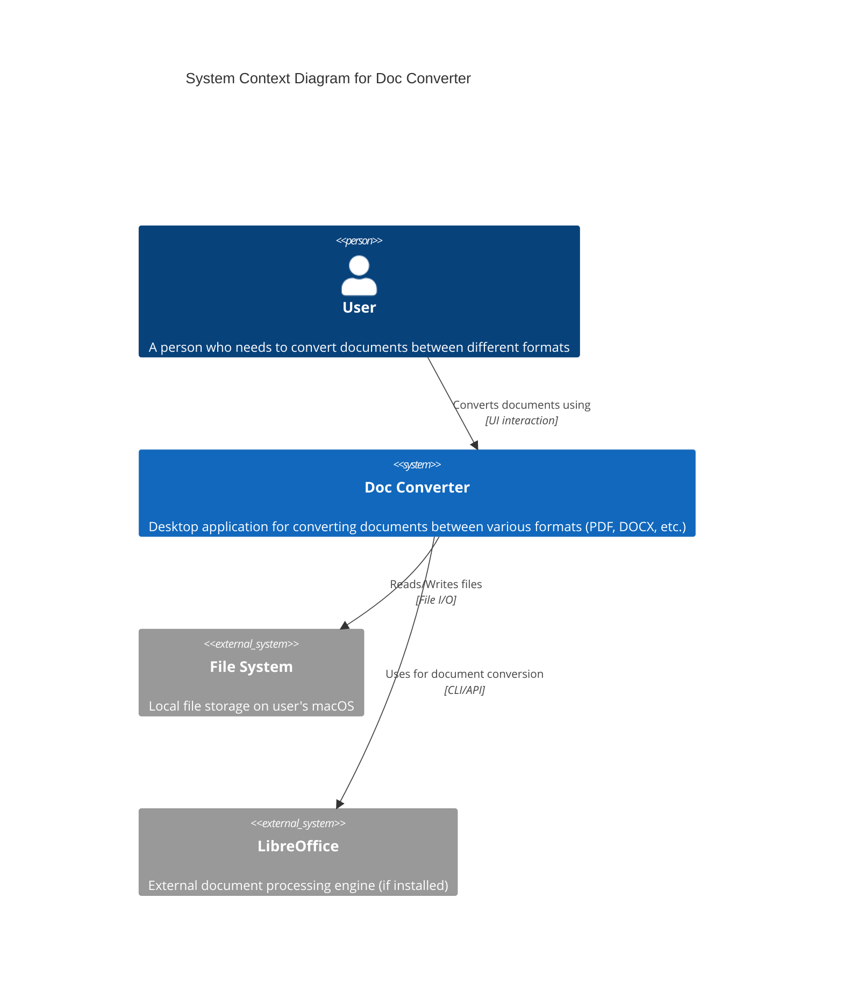

# C4 Model - Level 1: System Context Diagram

## Doc Converter - System Context

## Description

**Doc Converter** is a macOS desktop application built with Electron that enables users to convert documents between different formats.

### Users
- **End Users**: Individuals who need to convert documents (PDF, DOCX, etc.) on their macOS machine

### External Systems
- **File System**: Local storage for reading input files and writing converted outputs
- **LibreOffice**: Optional external conversion engine for advanced document processing

### Key Interactions
1. User selects files through the application UI
2. Application processes and converts documents using internal libraries (JSZip) and potentially external tools
3. Converted files are saved back to the file system

## System Boundary
The Doc Converter application operates entirely on the user's local machine, with no cloud dependencies or external APIs (beyond optional LibreOffice integration).
