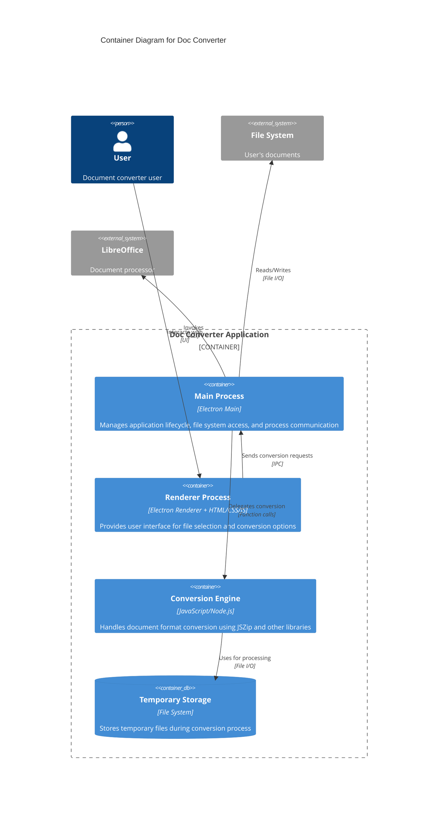

# C4 Model - Level 2: Container Diagram

## Doc Converter - Container Architecture

## Container Details

### Main Process (Electron Main)
**Technology**: Node.js / Electron Main Process

**Responsibilities**:
- Application lifecycle management (startup, shutdown)
- File system access and security
- Inter-process communication with renderer
- Coordination of conversion operations
- Integration with external tools (LibreOffice)

**Key Dependencies**:
- Electron Framework
- Node.js File System APIs

### Renderer Process (Electron Renderer)
**Technology**: Chromium / HTML / CSS / JavaScript

**Responsibilities**:
- User interface presentation
- File selection dialogs
- Conversion progress display
- User preferences management

**Key Dependencies**:
- Electron Renderer APIs
- Web technologies (HTML5, CSS3, ES6+)

### Conversion Engine
**Technology**: JavaScript / Node.js

**Responsibilities**:
- Document format detection
- Conversion logic implementation
- ZIP archive manipulation (via JSZip)
- Format-specific transformations
- Error handling and validation

**Key Dependencies**:
- JSZip (v3.10.1) - ZIP file manipulation
- Pako - Compression/decompression
- Additional format-specific libraries

### Temporary Storage
**Technology**: File System

**Responsibilities**:
- Storing intermediate conversion files
- Caching extracted archive contents
- Temporary workspace for complex conversions

## Communication Patterns

### IPC (Inter-Process Communication)
- **Renderer → Main**: File selection events, conversion requests
- **Main → Renderer**: Progress updates, completion notifications, errors

### File I/O
- **Synchronous**: Configuration reading, small file operations
- **Asynchronous**: Large file conversions, batch processing

## Security Considerations
- File system access controlled through Electron's context isolation
- User-selected files only (no automatic file scanning)
- Temporary files cleaned up after conversion
