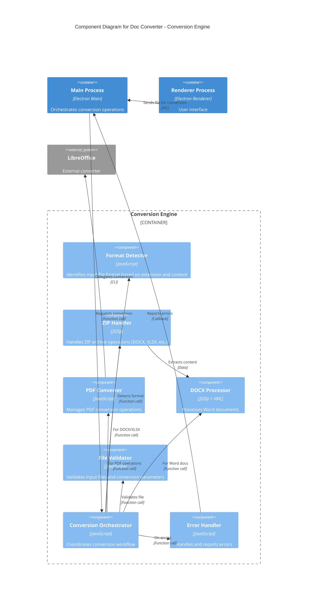

# C4 Model - Level 3: Component Diagram

## Doc Converter - Component Architecture



## Component Details

### Conversion Orchestrator
**Purpose**: Central coordinator for all conversion operations

**Responsibilities**:
- Receives conversion requests from Main Process
- Determines conversion strategy based on source/target formats
- Delegates to appropriate format handlers
- Manages conversion workflow and state
- Reports progress and completion

**Interfaces**:
```javascript
interface ConversionOrchestrator {
  convert(inputPath: string, outputPath: string, options: ConversionOptions): Promise<ConversionResult>
  validateConversion(inputFormat: string, outputFormat: string): boolean
  getSupportedFormats(): string[]
}
```

### Format Detector
**Purpose**: Identifies file formats

**Responsibilities**:
- Analyzes file extensions
- Reads file headers/magic numbers
- Validates format compatibility

**Supported Formats**:
- DOCX, DOC (Word documents)
- PDF (Portable Document Format)
- XLSX, XLS (Excel spreadsheets)
- ZIP archives
- Plain text formats

### ZIP Handler (JSZip)
**Purpose**: Manages ZIP archive operations

**Responsibilities**:
- Extracts ZIP archives
- Creates new ZIP archives
- Modifies ZIP contents
- Handles compression/decompression

**Key Dependency**: JSZip v3.10.1

**Usage**:
- DOCX files (ZIP with XML)
- XLSX files (ZIP with XML)
- ODT/ODS files (OpenDocument)

### DOCX Processor
**Purpose**: Handles Microsoft Word document structure

**Responsibilities**:
- Parses DOCX XML structure
- Extracts text content
- Processes formatting information
- Handles embedded media
- Maintains document relationships

**File Structure**:
```
document.xml      - Main content
styles.xml        - Style definitions
settings.xml      - Document settings
_rels/            - Relationships
word/media/       - Embedded images
```

### PDF Converter
**Purpose**: Manages PDF conversion operations

**Responsibilities**:
- PDF to other formats conversion
- Other formats to PDF conversion
- Invokes external tools (LibreOffice)
- Handles PDF metadata

**Dependencies**:
- LibreOffice (external, optional)
- PDF processing libraries

### File Validator
**Purpose**: Ensures input file quality and security

**Responsibilities**:
- File size validation
- Format verification
- Security checks (malware patterns)
- Path sanitization
- Permission checks

**Validation Rules**:
- Maximum file size limits
- Supported format whitelist
- Path traversal prevention
- Extension validation

### Error Handler
**Purpose**: Centralized error management

**Responsibilities**:
- Error categorization
- User-friendly error messages
- Error logging
- Recovery strategies
- Error reporting to Main Process

**Error Categories**:
- File not found
- Unsupported format
- Conversion failure
- Permission denied
- Corrupted file

## Data Flow

### Typical Conversion Flow

1. **User selects file** → Renderer Process
2. **File path sent** → Main Process (IPC)
3. **Conversion requested** → Conversion Orchestrator
4. **Format detected** → Format Detector
5. **File validated** → File Validator
6. **Appropriate handler selected** → ZIP Handler or PDF Converter
7. **Conversion executed** → Format-specific processing
8. **Output generated** → File System
9. **Completion reported** → Main Process → Renderer

## Component Dependencies

```
Conversion Orchestrator
├── Format Detector
├── File Validator
├── ZIP Handler (JSZip)
│   └── DOCX Processor
├── PDF Converter
│   └── LibreOffice (external)
└── Error Handler
```

## Performance Considerations

- **Asynchronous Processing**: All conversion operations use Promises
- **Streaming**: Large files processed in chunks
- **Memory Management**: ZIP contents extracted to temporary files
- **Parallel Processing**: Multiple conversions can run concurrently
