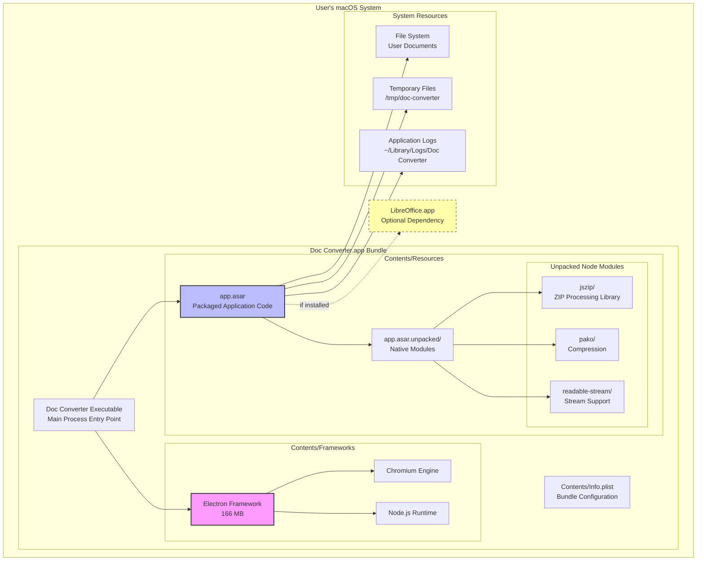
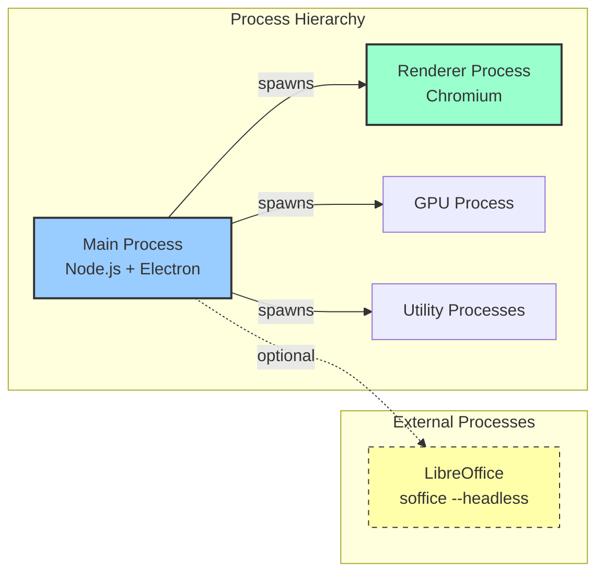
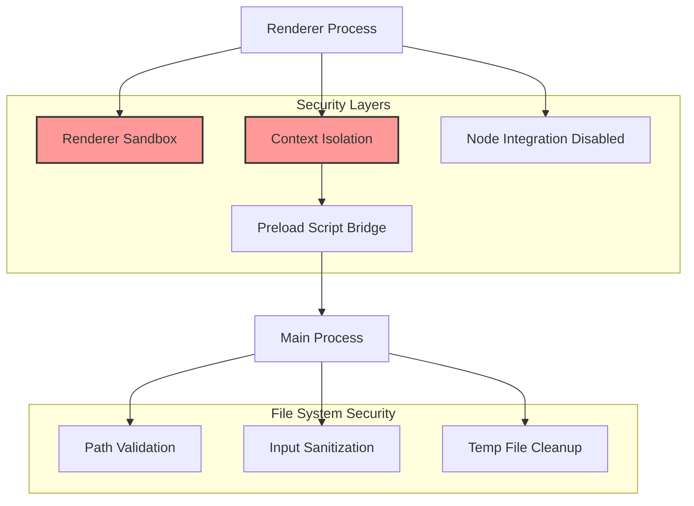

# Deployment Architecture

## Deployment Diagram - macOS Application Bundle



## Application Bundle Structure

```
Doc Converter.app/
├── Contents/
│   ├── MacOS/
│   │   └── Doc Converter          # Main executable (Electron wrapper)
│   │
│   ├── Resources/
│   │   ├── app.asar               # Packaged application (~15 MB)
│   │   │   └── [Compressed application code]
│   │   │
│   │   ├── app.asar.unpacked/     # Native/unpackable modules
│   │   │   └── node_modules/
│   │   │       ├── jszip/         # ZIP library
│   │   │       ├── pako/          # Compression
│   │   │       ├── readable-stream/
│   │   │       └── lie/           # Promise polyfill
│   │   │
│   │   └── icon.icns              # Application icon
│   │
│   ├── Frameworks/
│   │   └── Electron Framework.framework/
│   │       ├── Electron Framework (166 MB)
│   │       ├── Versions/A/
│   │       │   ├── Helpers/
│   │       │   │   └── chrome_crashpad_handler
│   │       │   ├── Libraries/
│   │       │   │   ├── libEGL.dylib
│   │       │   │   ├── libGLESv2.dylib
│   │       │   │   ├── libffmpeg.dylib
│   │       │   │   └── libvk_swiftshader.dylib
│   │       │   └── Resources/
│   │       │       ├── locales/ (100+ language files)
│   │       │       └── resources.pak
│   │       │
│   │       └── Helper Apps/
│   │           ├── Doc Converter Helper.app
│   │           ├── Doc Converter Helper (GPU).app
│   │           ├── Doc Converter Helper (Renderer).app
│   │           └── Doc Converter Helper (Plugin).app
│   │
│   └── Info.plist                 # Bundle metadata
│       ├── CFBundleExecutable: "Doc Converter"
│       ├── CFBundleIdentifier: "com.docconverter.app"
│       └── CFBundleVersion: "1.0.0"
```

## Runtime Environment

### Process Architecture



### Memory Layout

```
┌─────────────────────────────────────────┐
│  Main Process (~50-80 MB)               │
│  ├─ Node.js Runtime                     │
│  ├─ Electron APIs                       │
│  ├─ Application Logic                   │
│  └─ File System Operations              │
└─────────────────────────────────────────┘

┌─────────────────────────────────────────┐
│  Renderer Process (~80-150 MB)          │
│  ├─ Chromium Engine                     │
│  ├─ DOM/CSS Rendering                   │
│  ├─ JavaScript VM (V8)                  │
│  └─ UI State                            │
└─────────────────────────────────────────┘

┌─────────────────────────────────────────┐
│  GPU Process (~30-50 MB)                │
│  └─ Graphics Acceleration               │
└─────────────────────────────────────────┘

Total: ~160-280 MB (idle)
Peak: ~400-600 MB (during conversion)
```

## File System Locations

### Application Data

```
/Applications/Doc Converter.app/
    └─ Application bundle (read-only)

~/Library/Application Support/Doc Converter/
    ├─ config.json               # User preferences
    ├─ recent-files.json         # Recent conversions
    └─ cache/                    # Temporary cache

~/Library/Logs/Doc Converter/
    ├─ main.log                  # Main process logs
    ├─ renderer.log              # Renderer logs
    └─ crash-reports/            # Crash dumps

/tmp/doc-converter-{pid}/
    └─ [Temporary conversion files]
```

### Optional Dependencies

```
/Applications/LibreOffice.app/
    └─ Contents/MacOS/soffice    # LibreOffice executable
```

## Network & Security

### Network Access
```
✗ No outbound network connections
✗ No cloud services
✗ No telemetry or analytics
✓ Fully offline operation
```

### Security Features



## System Requirements

### Minimum
- **OS**: macOS 10.13 (High Sierra)
- **RAM**: 512 MB available
- **Disk**: 250 MB (app) + 500 MB (temp space)
- **CPU**: Intel Core 2 Duo or better

### Recommended
- **OS**: macOS 11.0 (Big Sur) or later
- **RAM**: 2 GB available
- **Disk**: 1 GB free space
- **CPU**: Intel Core i5 or Apple Silicon

### Optional
- **LibreOffice**: 7.0+ for advanced conversions (~600 MB)

## Installation & Distribution

### Distribution Method
```
Direct Download
    ↓
DMG Disk Image
    ↓
Drag & Drop to /Applications
    ↓
First Launch (Gatekeeper Check)
    ↓
Application Ready
```

### Code Signing
```
codesign --deep --force --verify --verbose --sign "Developer ID" Doc Converter.app
```

### Notarization (for macOS 10.15+)
```
xcrun notarytool submit DocConverter.dmg --wait
xcrun stapler staple Doc Converter.app
```

## Update Strategy

### Current: Manual Updates
1. User downloads new version
2. Replaces old .app with new .app
3. Preferences preserved (separate Application Support folder)

### Future: Auto-Update (electron-updater)
```
App Startup
    ↓
Check for Updates (GitHub Releases)
    ↓
Download if Available
    ↓
Install on Next Launch
```

## Performance Characteristics

### Startup Time
```
Cold Start:  2-3 seconds
Warm Start:  1-2 seconds
```

### Conversion Performance
```
Small File (<1 MB):    < 1 second
Medium File (1-10 MB): 1-5 seconds
Large File (>10 MB):   5-30 seconds
```

### Disk I/O
```
Read Speed:  Limited by disk (SSD: ~500 MB/s, HDD: ~100 MB/s)
Write Speed: Limited by disk
Temp Usage:  2-3x input file size during conversion
```

## Troubleshooting

### Common Issues

**App Won't Open**
```bash
# Check quarantine attribute
xattr -d com.apple.quarantine /Applications/Doc\ Converter.app

# Verify code signature
codesign --verify --verbose /Applications/Doc\ Converter.app
```

**LibreOffice Not Detected**
```bash
# Verify installation
ls /Applications/LibreOffice.app/Contents/MacOS/soffice

# Test manually
/Applications/LibreOffice.app/Contents/MacOS/soffice --version
```

**High Memory Usage**
```bash
# Check process memory
ps aux | grep "Doc Converter"

# Clear temp files
rm -rf /tmp/doc-converter-*
```

---

**Last Updated**: 2025-11-04
**Deployment Version**: 1.0.0
