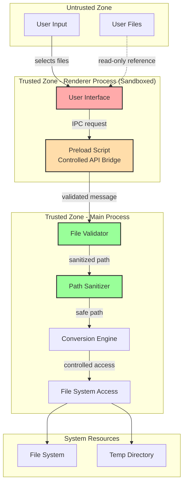

# Security Architecture

## Security Model Overview



## Security Layers

### Layer 1: Renderer Process Sandboxing

**Configuration** (main.js):
```javascript
const mainWindow = new BrowserWindow({
  width: 1200,
  height: 800,
  webPreferences: {
    sandbox: true,                    // Enable Chromium sandbox
    contextIsolation: true,           // Isolate context
    nodeIntegration: false,           // Disable Node.js in renderer
    enableRemoteModule: false,        // Disable remote module
    webSecurity: true,                // Enable web security
    allowRunningInsecureContent: false,
    preload: path.join(__dirname, 'preload.js')
  }
});
```

**Security Benefits**:
- Renderer cannot access file system directly
- No direct Node.js API access
- Limited to web APIs only
- Communication only through IPC

### Layer 2: Context Isolation & Preload Script

**Preload Script** (preload.js):
```javascript
const { contextBridge, ipcRenderer } = require('electron');

// Expose ONLY safe APIs to renderer
contextBridge.exposeInMainWorld('electronAPI', {
  // File selection (returns path only, not content)
  selectFile: () => ipcRenderer.invoke('select-file'),

  // Conversion request (path validation happens in main)
  convertFile: (inputPath, outputFormat) =>
    ipcRenderer.invoke('convert-file', { inputPath, outputFormat }),

  // Progress updates (receive-only)
  onProgress: (callback) =>
    ipcRenderer.on('conversion-progress', (event, data) => callback(data)),

  // Results (receive-only)
  onComplete: (callback) =>
    ipcRenderer.on('conversion-complete', (event, data) => callback(data)),

  // Errors (receive-only)
  onError: (callback) =>
    ipcRenderer.on('conversion-error', (event, error) => callback(error))
});

// No other Node.js APIs exposed!
```

**Renderer Usage** (renderer.js):
```javascript
// Renderer can ONLY use exposed APIs
document.getElementById('convert-btn').addEventListener('click', async () => {
  const filePath = await window.electronAPI.selectFile();
  await window.electronAPI.convertFile(filePath, 'pdf');
});

// Cannot do this (no access):
// const fs = require('fs');  // ❌ Error!
// process.exit();            // ❌ Error!
```

### Layer 3: Input Validation

**File Path Validation** (main process):
```javascript
const path = require('path');

class SecurityValidator {
  validateFilePath(userPath) {
    // 1. Normalize path
    const normalized = path.normalize(userPath);

    // 2. Prevent directory traversal
    if (normalized.includes('..')) {
      throw new SecurityError('Path traversal detected');
    }

    // 3. Ensure absolute path
    if (!path.isAbsolute(normalized)) {
      throw new SecurityError('Relative paths not allowed');
    }

    // 4. Check if within allowed directories
    const allowedDirs = [
      os.homedir(),
      '/tmp'
    ];

    const isAllowed = allowedDirs.some(dir =>
      normalized.startsWith(path.resolve(dir))
    );

    if (!isAllowed) {
      throw new SecurityError('Access to this directory is not allowed');
    }

    return normalized;
  }

  validateFileType(filePath) {
    const allowedExtensions = [
      '.pdf', '.docx', '.doc', '.xlsx', '.xls',
      '.pptx', '.ppt', '.odt', '.ods', '.txt'
    ];

    const ext = path.extname(filePath).toLowerCase();

    if (!allowedExtensions.includes(ext)) {
      throw new SecurityError(`File type ${ext} not allowed`);
    }

    return ext;
  }

  async validateFileSize(filePath, maxSize = 100 * 1024 * 1024) {
    const stats = await fs.stat(filePath);

    if (stats.size > maxSize) {
      throw new SecurityError(
        `File too large: ${stats.size} bytes (max: ${maxSize})`
      );
    }

    return stats.size;
  }

  async validateFileContent(filePath) {
    // Read file header (magic bytes)
    const fd = await fs.open(filePath, 'r');
    const buffer = Buffer.alloc(8);
    await fd.read(buffer, 0, 8, 0);
    await fd.close();

    // Validate against expected file signatures
    const ext = path.extname(filePath).toLowerCase();
    const signatures = {
      '.pdf': [0x25, 0x50, 0x44, 0x46],  // %PDF
      '.docx': [0x50, 0x4B, 0x03, 0x04],  // ZIP signature (DOCX is ZIP)
      '.xlsx': [0x50, 0x4B, 0x03, 0x04]   // ZIP signature
    };

    const expected = signatures[ext];
    if (expected) {
      const matches = expected.every((byte, i) => buffer[i] === byte);
      if (!matches) {
        throw new SecurityError('File signature mismatch');
      }
    }

    return true;
  }
}
```

### Layer 4: ZIP Bomb Protection

**Safe ZIP Extraction**:
```javascript
async function safeZipExtraction(zipPath) {
  const MAX_UNCOMPRESSED_SIZE = 100 * 1024 * 1024; // 100 MB
  const MAX_FILE_COUNT = 10000;
  const MAX_COMPRESSION_RATIO = 100;

  const data = await fs.readFile(zipPath);
  const zip = await JSZip.loadAsync(data);

  let totalUncompressedSize = 0;
  let fileCount = 0;

  // Validate before extraction
  zip.forEach((relativePath, file) => {
    fileCount++;

    // Check file count
    if (fileCount > MAX_FILE_COUNT) {
      throw new SecurityError('ZIP contains too many files (ZIP bomb?)');
    }

    // Check path for traversal
    if (relativePath.includes('..') || path.isAbsolute(relativePath)) {
      throw new SecurityError(`Invalid file path in ZIP: ${relativePath}`);
    }

    // Accumulate uncompressed size
    totalUncompressedSize += file._data.uncompressedSize;

    // Check total uncompressed size
    if (totalUncompressedSize > MAX_UNCOMPRESSED_SIZE) {
      throw new SecurityError('ZIP decompresses to too large size (ZIP bomb?)');
    }

    // Check compression ratio
    const compressedSize = file._data.compressedSize;
    const uncompressedSize = file._data.uncompressedSize;
    const ratio = uncompressedSize / compressedSize;

    if (ratio > MAX_COMPRESSION_RATIO) {
      throw new SecurityError(
        `Suspicious compression ratio: ${ratio} (ZIP bomb?)`
      );
    }
  });

  return zip;
}
```

### Layer 5: Temporary File Security

**Secure Temp File Handling**:
```javascript
const crypto = require('crypto');
const os = require('os');

class TempFileManager {
  constructor() {
    this.tempFiles = new Set();
    this.tempDir = path.join(os.tmpdir(), 'doc-converter');
  }

  async createSecureTempDir() {
    // Create unique temp directory
    const random = crypto.randomBytes(16).toString('hex');
    const dir = path.join(this.tempDir, `session-${random}`);

    await fs.mkdir(dir, { recursive: true, mode: 0o700 }); // rwx------
    return dir;
  }

  async createTempFile(prefix, extension) {
    const dir = await this.createSecureTempDir();
    const random = crypto.randomBytes(8).toString('hex');
    const filename = `${prefix}-${random}${extension}`;
    const filepath = path.join(dir, filename);

    // Track for cleanup
    this.tempFiles.add(filepath);

    return filepath;
  }

  async cleanup() {
    // Delete all tracked temp files
    for (const filepath of this.tempFiles) {
      try {
        await fs.unlink(filepath);
      } catch (error) {
        console.error(`Failed to delete temp file: ${filepath}`, error);
      }
    }

    // Delete temp directories
    try {
      await fs.rm(this.tempDir, { recursive: true, force: true });
    } catch (error) {
      console.error('Failed to delete temp directory', error);
    }

    this.tempFiles.clear();
  }
}

// Cleanup on exit
process.on('exit', () => tempFileManager.cleanup());
process.on('SIGINT', () => {
  tempFileManager.cleanup();
  process.exit();
});
```

### Layer 6: Process Isolation & Timeout

**LibreOffice Process Security**:
```javascript
const { spawn } = require('child_process');

async function secureLibreOfficeConversion(inputPath, outputFormat) {
  const TIMEOUT = 60000; // 60 seconds
  const MEMORY_LIMIT = 512 * 1024 * 1024; // 512 MB

  // Sanitize input path
  const safePath = sanitizePath(inputPath);

  return new Promise((resolve, reject) => {
    const process = spawn(
      libreOfficePath,
      ['--headless', '--convert-to', outputFormat, '--outdir', tempDir, safePath],
      {
        timeout: TIMEOUT,
        maxBuffer: MEMORY_LIMIT,
        shell: false, // IMPORTANT: Prevent shell injection
        env: {
          // Minimal environment variables
          HOME: os.homedir(),
          PATH: '/usr/bin:/bin'
        }
      }
    );

    // Timeout handling
    const timeoutId = setTimeout(() => {
      process.kill('SIGTERM');
      reject(new Error('Conversion timed out'));
    }, TIMEOUT);

    process.on('close', (code) => {
      clearTimeout(timeoutId);
      if (code === 0) {
        resolve();
      } else {
        reject(new Error(`Conversion failed with code ${code}`));
      }
    });
  });
}
```

## Security Checklist

### Application Security
- [x] Renderer sandbox enabled
- [x] Context isolation enabled
- [x] Node integration disabled in renderer
- [x] Remote module disabled
- [x] Web security enabled
- [x] Content Security Policy defined
- [x] Preload script with minimal API surface

### Input Validation
- [x] Path traversal prevention
- [x] File type whitelist
- [x] File size limits
- [x] File signature validation
- [x] ZIP bomb protection
- [x] Compression ratio limits

### Process Security
- [x] External process isolation
- [x] Timeout enforcement
- [x] Memory limits
- [x] Shell injection prevention (shell: false)
- [x] Minimal environment variables

### File System Security
- [x] Temporary file cleanup
- [x] Secure file permissions (0o700)
- [x] Unique temp directories
- [x] No predictable file names
- [x] Cleanup on exit/crash

### Data Protection
- [x] No network access
- [x] No telemetry
- [x] No cloud storage
- [x] Secure local-only operation
- [x] No sensitive data in logs

## Threat Model

### Threats Mitigated

| Threat | Mitigation |
|--------|-----------|
| **Malicious File Upload** | File type validation, signature checking |
| **ZIP Bomb** | Compression ratio limits, size limits |
| **Path Traversal** | Path normalization, directory whitelist |
| **Code Injection** | No eval(), shell: false, input sanitization |
| **XSS** | CSP, context isolation, sandboxing |
| **Privilege Escalation** | Sandboxed renderer, no Node.js in UI |
| **DoS (Resource Exhaustion)** | Timeouts, memory limits, file size limits |
| **Temp File Exploitation** | Secure permissions, random names, cleanup |

### Remaining Risks

| Risk | Severity | Mitigation Plan |
|------|----------|----------------|
| **Electron Vulnerabilities** | Medium | Regular framework updates |
| **LibreOffice Exploits** | Low | Optional dependency, process isolation |
| **Disk Space Exhaustion** | Low | Temp file limits, cleanup |
| **Corrupted File Crashes** | Low | Error handling, try-catch blocks |

---

**Security Review Date**: 2025-11-04
**Next Review**: 2026-05-04
**Reviewed By**: Security Architecture Team
